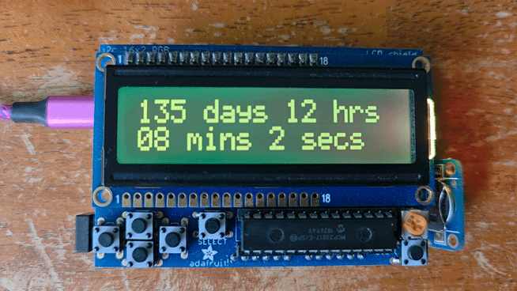
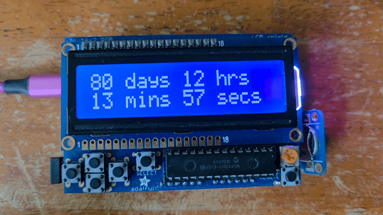
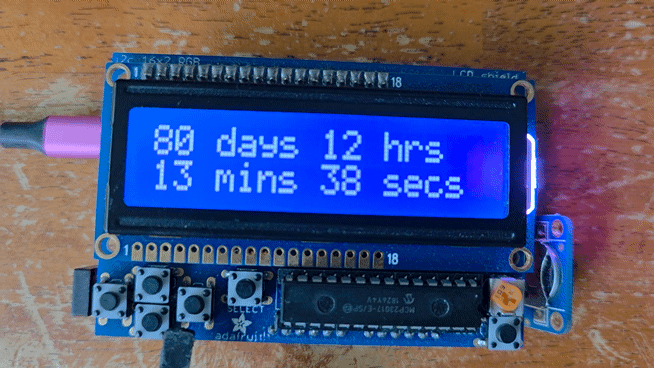
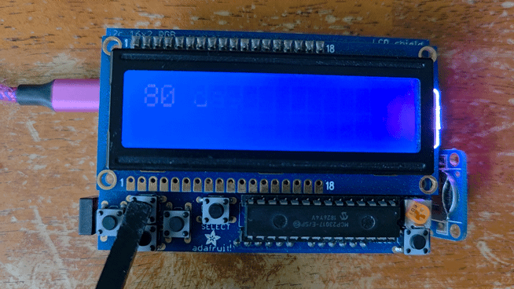
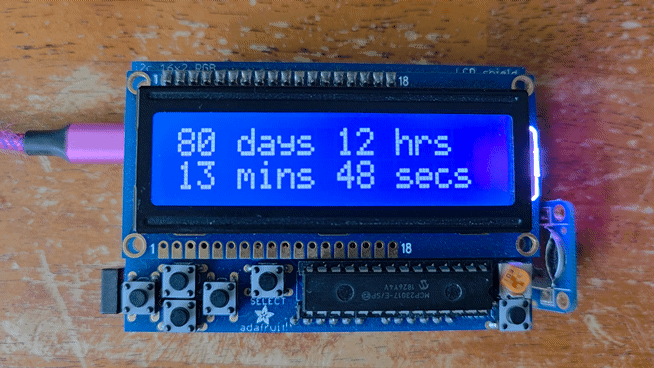
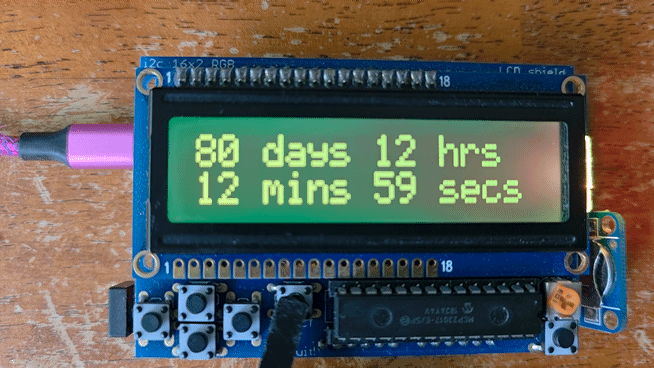

# Arduino Event Countdown Display

Countdown 16x2 Character LCD

An Arduino-based countdown display that uses an Adafruit RGB LCD Shield and DS3231 Real-Time Clock (RTC) to display the time remaining until upcoming events.

---

The project supports multiple target dates, RGB backlight colors, and button-controlled display functions.



*I created this countdown timer many many years ago when I first got an UNO microcontroller simply as a learning tool for doing DIY projects, and I still use the countdown today to anticipate upcoming events. Since then, to fully utilize the hardware, I have added new functionality using the button inputs on the LCD shield.*

## Features
* Countdown to a target date and time
* Counts the number of:
    + Days
    + Hours
    + Minutes
    + Seconds
* Displays a number of fun messages through button controls
* Pick different backlight colors
* Show current time
* Supports multiple target events
* SELECT button cycles through upcoming events chronologically
* When timer counts down to zero when even arrives, a message will appear.


## Hardware
* [Arduino UNO](https://store-usa.arduino.cc/collections/uno/products/arduino-uno-rev3)
* [Adafruit RGB LCD Shield](https://learn.adafruit.com/rgb-lcd-shield/) for:
    + 16x2 LCD display
    + RGB backlight
    + Button input
* [DS3231 RTC](https://learn.adafruit.com/adafruit-ds3231-precision-rtc-breakout) for accurate date/time
* CR1220 coin battery

## Libraries

The project uses:

```
#include <Wire.h>
#include <Adafruit_RGBLCDShield.h>
#include <RTClib.h>
```

## Configuration

+ Target events are defined in the sketch using a Target structure:

Example:

```
Target targets[] = {
  {"Christmas", 2026, 12, 25, 0, 0, 0},
  {"Birthday",  2027, 3, 10, 0, 0, 0},
  {"Vacation",  2027, 6, 15, 8, 30, 0}
};
```

Multiple events can be stored in the targets[] array.

The sketch determines the next event chronologically rather than relying on the order of the array.

For example:

_Birthday    September 20_
_Vacation    October 15_
_Christmas   December 25_
_New Year    January 1_


The SELECT button cycles through countdown in chronological order:
```
Birthday
   ↓
Vacation
   ↓
Christmas
   ↓
New Year
   ↓
Birthday
```

Events that have already passed are skipped.

+ Add custom messages to fnMessages[] list:
```
const char* fnMessages[] = { 
  "party",
  "cake",
  "holiday",
  "celebration",
  "treats",
  "fun",
  "gifts",
  "cocktails",
  "holiday",
  "cheers",
  "scary clowns"
};
```

Upload `.ino` sketch to the UNO board using the [Arduino IDE](https://docs.arduino.cc/software/ide/).

#### LCD Display

The display uses a 16x2 Character LCD shield that is installed on top of the UNO headers. The LCD screen has [negative RGB backlight](https://www.adafruit.com/product/399).

Example countdown:

```
137 days 13 hrs
42 mins 31 secs
```


#### Setting the RTC

The RTC should generally be set only **once** to the correct date and time.

Example:

> rtc.adjust(DateTime(F(__DATE__), F(__TIME__)));

in setup(), the RTC can be reset to the sketch compile time every time the Arduino is powered on.


#### Buttons

+ LEFT Button

    >Show current date and time

    

+ RIGHT Button
    
    >Show target event name

    

+ UP Button 

    > Change Backlight color _(WHITE, VIOLET, YELLOW, GREEN, TEAL, BLUE, RED)_

    

+ DOWN Button

    >Show message

    

+ SELECT Button

    > Change Target date to next event -  resets the countdown timer to new target date

     [alt text]

#### Future Improvements

Potential enhancements:
- Show "No more upcoming events" if no future events left to display.
- Add different messaages per target event
- Add alarm/buzzer when countdown reaches zero
- Add automatic backlight changes
